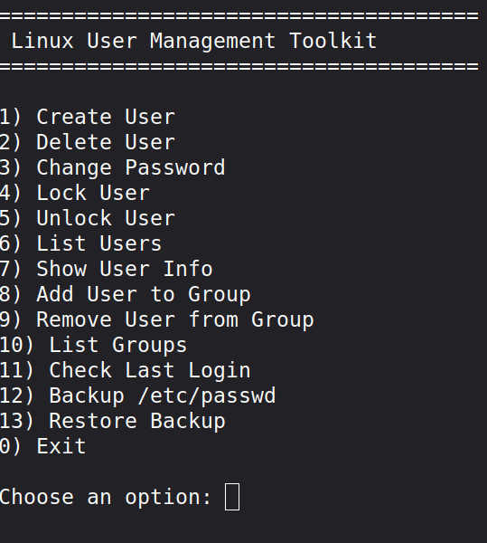

## Main Menu



# Linux User Management Toolkit

A simple Bash project for managing Linux users and groups through an interactive command-line menu.

...

## License

This project is licensed under the MIT License.

---

# 🇮🇷 نسخه فارسی

## معرفی پروژه

این پروژه یک ابزار مدیریت کاربران لینوکس است که با استفاده از Bash Script نوشته شده است.

هدف از این پروژه، تمرین مباحث مهم Bash و مدیریت کاربران لینوکس بوده است.

---

## امکانات

- ایجاد کاربر جدید
- حذف کاربر
- تغییر رمز عبور
- قفل کردن حساب کاربری
- باز کردن قفل حساب کاربری
- نمایش لیست کاربران
- نمایش اطلاعات یک کاربر
- افزودن کاربر به گروه
- حذف کاربر از گروه
- نمایش گروه‌های سیستم
- مشاهده آخرین ورود کاربران
- تهیه نسخه پشتیبان از فایل `/etc/passwd`
- بازیابی نسخه پشتیبان

---

## ساختار پروژه

```text
linux-user-management/
│
├── backup/
│
├── images/
│
├── lib/
│   ├── backup.sh
│   ├── groups.sh
│   ├── users.sh
│   └── utils.sh
│
├── log/
│
├── user-manager.sh
├── README.md
└── LICENSE
```

---

## پیش‌نیازها

- Linux
- Bash
- دسترسی Root

---

## نحوه اجرا

ابتدا پروژه را دریافت کنید:

```bash
git clone https://github.com/your-username/linux-user-management.git
```

وارد پوشه پروژه شوید:

```bash
cd linux-user-management
```

مجوز اجرا را بدهید:

```bash
chmod +x user-manager.sh
```

سپس برنامه را اجرا کنید:

```bash
sudo ./user-manager.sh
```

---

## تصاویر

### منوی اصلی


---

### ایجاد کاربر


---

### نمایش کاربران


---

## دستورات استفاده شده

در این پروژه از دستورات زیر استفاده شده است:

- useradd
- userdel
- usermod
- passwd
- gpasswd
- id
- lastlog
- awk
- cut
- cp

---

## هدف آموزشی پروژه

در این پروژه مفاهیم زیر تمرین شده‌اند:

- Bash Scripting
- نوشتن توابع
- شرط‌ها
- حلقه‌ها
- مدیریت کاربران
- مدیریت گروه‌ها
- کار با فایل‌ها
- مدیریت سیستم‌عامل لینوکس

---

## توسعه‌های آینده

- رنگی کردن خروجی ترمینال
- سیستم ثبت لاگ
- مدیریت بهتر خطاها
- تهیه نسخه پشتیبان فشرده
- فایل تنظیمات (Configuration File)

---

## مجوز

این پروژه تحت مجوز MIT منتشر شده است.
